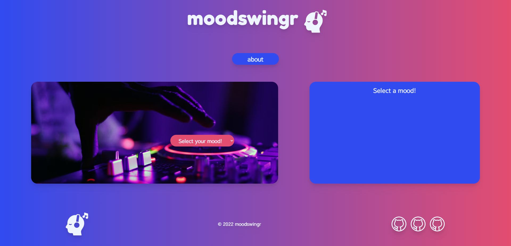
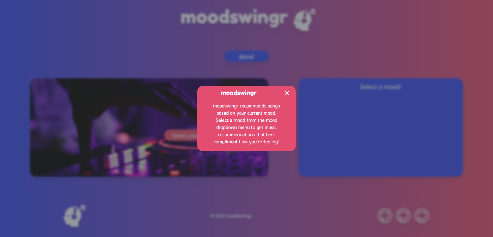
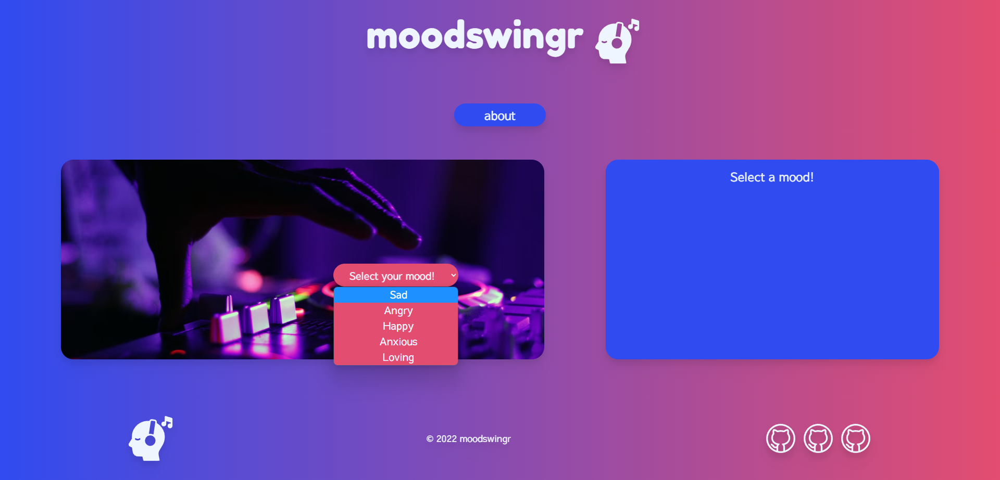
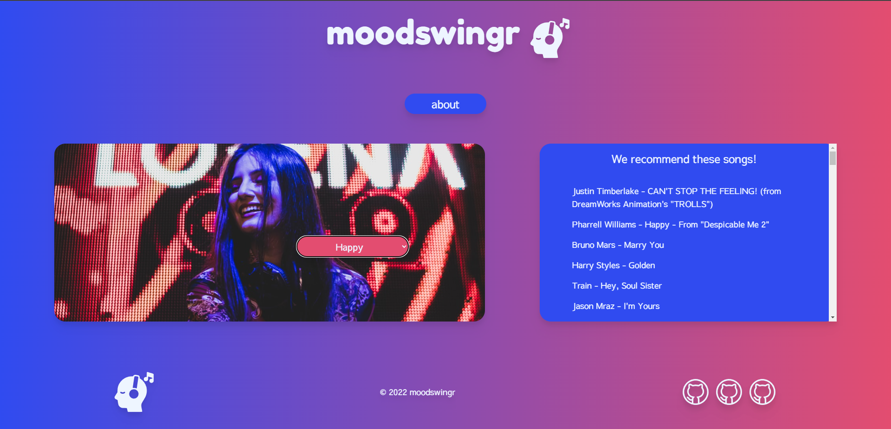
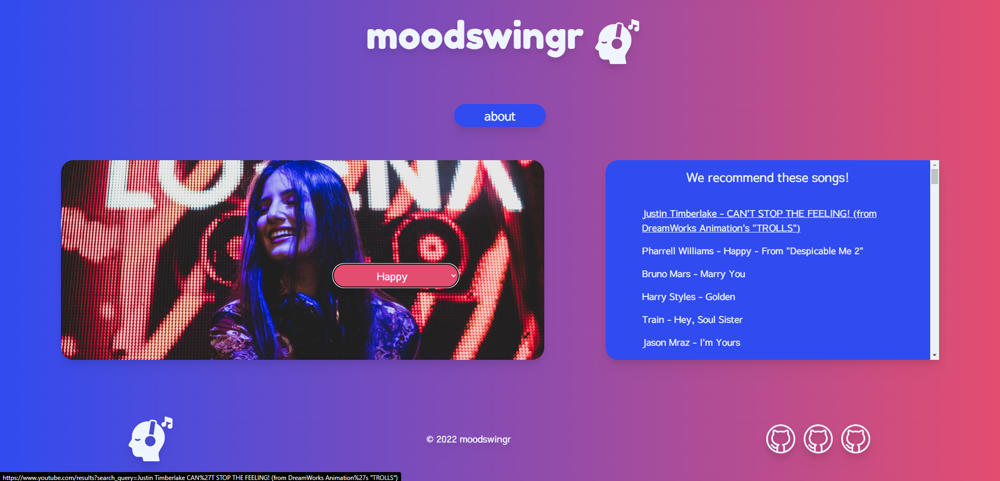
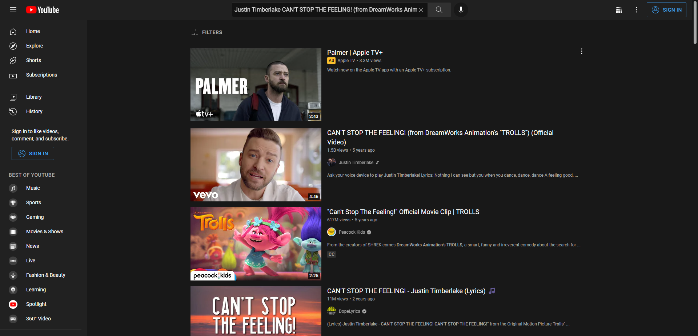

# Project 01

The objective of this challenge was to create a project with group using all of the knowledge we've gained to create an application to showcase to future employers. The acceptance criteria for this project are as follows:

## Acceptance Criteria

```
Use a CSS framework other than Bootstrap.

Be deployed to GitHub Pages.

Be interactive (i.e: accept and respond to user input).

Use at least two server-side APIs.

Does not use alerts, confirms, or prompts (use modals).

Use client-side storage to store persistent data.

Be responsive.

Have a polished UI.

Have a clean repository that meets quality coding standards (file structure, naming conventions, follows best practices for class/id-naming conventions, indentation, quality comments, etc.).

Have a quality README (with unique name, description, technologies used, screenshot, and link to deployed application).
```
## Technologies Used

Vanilla JS
TailwindCSS
HTML5

## APIs Used

Spotify API
Unsplash API

## The following screenshots demonstrate the application functionality:

Initial webpage:



About modal:



Mood dropdown:



Populated playlist:



Links of populated:



YOutube search query:




## Deployed App

[GH Pages](https://realnifty.github.io/Project-1/)